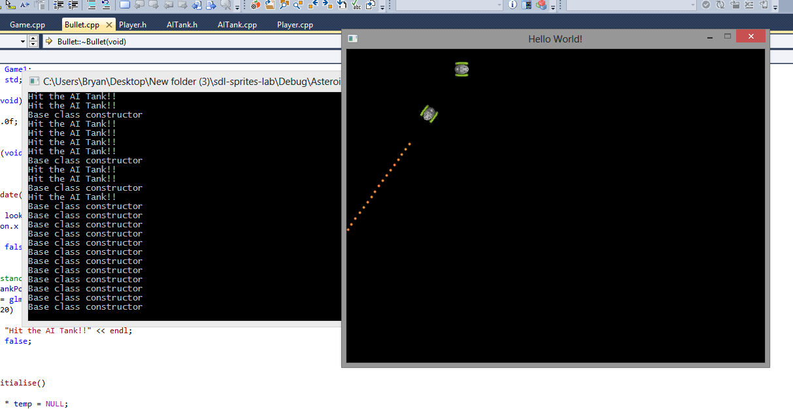
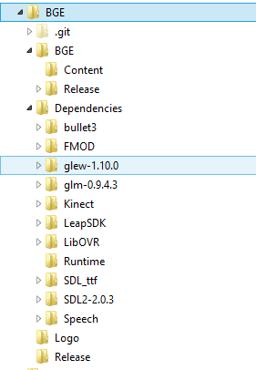

Game Engines 1 Labs
===================

Lab 3
-----
In this lab you will get the opportunity to use some vector maths to solve some problems in games. Be sure you know how to:

- Add/subtract vectors 
- Calculate the distance between two vectors using ```glm::length```
- Use the vector dot product (```glm::dot```) and inverse cos (```glm::acos```)

If you need some revision on this, be sure to read the [game maths lecture notes](../Course) again.
 
Firstly, navigate to where you have cloned the repo and checkout the branch for the lab:

```bash
git checkout -b Lab3 origin/Lab3
```

You might need to do a git fetch if you have cloned from my repo

```bash
git fetch
```

To get the branch, or if you are working from a fork, you might need to fetch from the upstream remote into your fork:

```bash
git fetch upstream
```

When you run the project you should see this:


Note that you can move and rotate the camera using WASD and mouse look. The ship on the right is called a Ferdelance. Note that you can move it forward by press the UP key and you can rotate it by pressing the LEFT arrow key. The ship on the left is called a Cobra Mk III.

Now open up the file Lab3.cpp and observe the ```Update``` member function

### Problem 1

Add the missing code to complete the Ferdelance movements - to move backwards and to rotate to the right. Based on the code, can you figure out which direction rotations work in OpenGL clockwise or counterclockwise?

### Problem 2

Add code to move and rotate the Cobra MK III in response to the UHJK keys.

### Problem 3

Add code to calculate the distance between ship1 and ship2. If the distance is < 5 units you should print a message saying "In Range", otherwise print the message "Not in range". You can use:

```C++
PrintMessage("Hello");
```

To print a message to the list of messages on the screen. Move ship2 around the place and make sure this works ok.

### Problem 4

Write code to check to see if ship2 is in front of or behind ship1. Print the messages "In front" or "Behind"

### Problem 5

Write code to check to see if ship2 is inside the FOV of ship1. Use a 45 degree FOV. You need to draw this problem out on paper before attempting to solve it. Use the dot product in your solution.

### Problem 6

If ship2 is inside the FOV of ship1, fire lazer beams at a rate of 2 per second. To fire a single lazerbeam, use the following code:

```C++
shared_ptr<LazerBeam> lazer = make_shared<LazerBeam>();
Attach(lazer);
```

This attaches a lazerbeam object to the scene. Dont forget to set the lazer beam look and position vectors!

If all goes well, your final scene should look like this:


Lab 2
-----
The aim of this lab is to create a new class called AITank that patrolls around the outside of the screen. As a bonus, you can have bullets dissappear when they come within 20 units of the centre of the AI tank. You can print a message out on the console when this happens. Here is a screenshot of what the finished lab should look like:



To get started!

Clone the solution to last weeks lab by typing: 

```bash
git clone solution  https://github.com/skooter500/sdl-sprites-lab
```

If you already have a build of the project on your computer, you can just get the solution branch by navigating to where you have the project cloned to already and typing:

```bash
git checkout -b solution origin/solution
```

To get the constants for pi etc:

Put 

```C++
#include <glm/gtx/constants.hpp>
```

At the top of any file that needs them

Use: 
```C++ 
glm::pi<float>()
``` 
and 
```C++ 
glm::half_pi<float>() 
``` 
Etc.

You can just crack on and see if you can complete the lab, though here are step-by step instructions if you need them:

- Start by creating a new class called ```AITank``` and make it extend ```GameComponent ```. Check out the player class for a template for this.
- Give it the same member functions and variables as the ```Player``` class
- In the constructor, set the initial position, rotation and look vector values. Use the unit circle to see what these should be.
- Copy the ```Initialise``` and ```Draw``` member functions from ```Player```
- In ```Update```, just move the tank in the direction of it's look vector and recalculate the look vector based on the rotation member variable. (For now)
- In the ```Game``` class, make a shared_ptr member variable public member of the class
- In the ```Initialise``` method of the ```Game``` class, create the instance and add it to the list of children
- Now in the ```Update``` member function of the ```AITank```, put in code to rotate the tank when it reaches close to the bounds of the screen
- Once you have that all working, in the ```Bullet``` Update method, get the ```AITank``` shared_ptr from ```Game::Instance()``` (remember you made it a member variable earlier?)
- Calculate the distance to the ```AITank``` and if < 20, set the bullat alive flag to be false etc.
Have fun!!

Think about your assignment

Lab 1
-----
### Part 1
In this weeks lab you will be installing some of the prerequisites required to run the BGE code in the lab. 

Firstly you will have to clone the source code for this weeks lab from the git hub repo...

Start a git bash shell, create a new folder on your U drive or a USB stick and navigate to it.

Type the following EXACTLY:


git clone https://github.com/skooter500/sdl-sprites-lab

This will fetch the required files, including the visual studio project file from the github repository. If you navigate to the folder and open up the Visual Studio Solution and hit F5, you will see that the project will not compile. This is because you are missing two required open source libraries to run the project. These are:

GLM - Maths Library

SDL - Simple Direct Media Library. This is a really cool open source game development library that provides cross platform access to hardware such as screen buffers, the keyboard & mouse, audio etc. Its used in lots of commercial games such as Valve's Team Fortress 2

Firstly go to [http://glm.g-truc.net/0.9.5/index.html](http://glm.g-truc.net/0.9.5/index.html) and download and install the GLM libraries. This is a header file only library. To set this up in your project, navigate to:

Project | Properties | VC++ Directories | Include Directories - And enter the path to the include directory for the GLM libraries you just downloaded

Make sure you select the project in the project explorer first!

Now go to  [http://www.libsdl.org/download-2.0.php](http://www.libsdl.org/download-2.0.php) and download the appropriate Development Libraries for your platform (Windows or Mac)

Go to: 

Project | Properties | VC++ Directories | Include Directories - And enter the path to the include folder in SDL

Go to:

Project | Properties | VC++ Directories | Libary Directories -  And enter the path to the lib\x86 folder in SDL

There are similar settings for Xcode/Eclipse for those on the mac.

You might find it easier to navigate to the folder in Explorer and copy the paths out of the address bar.

Now go to:

Project | Properties |  Linker | Input | Additional Dependancies

And ADD SDL2main.lib;SDL2.lib;

If you have followed the above steps EXACTLY your program should now build

BUT Guess What! It wont run. Visual Studio will complain about a missing SDL DLL. 

There are several ways to solve this problem, but the easiest is to add the path to the sdl dll files to the Project | Properties | Debugging | Environment setting:


If all the above works you should get a screen like this:


Congratulations! 

If you didnt get a screen like this, go back and make sure you have followed the steps correctly. 

Now spend some time to understand the code. The main classes are:

GameComponent - Everything in the game will extend this.

Game - Extends GameComponent and keeps an stl::list of GameComponent's (like a List in C# or an ArrayList in Java)

Player - Extends GameComponent and manages the player sprite

You should realise that the code is not much different to what we wrte in the class last week, just with rendering added.

Some things to try:

Try and figure out how to get the player tank to rotate in response to the left and right arrow keys. You might remember how to do this from second year Allegro :-) You can use the following:

```C++
glm::sin(theta);
glm::cos(theta);
```

To calculate the look vector based on the value of rotation. These functions accept parameters in RADIANS. Keep in mind that the rotation parameter to the function:
```C++
SDL_RenderCopyEx
```
Needs to be in DEGREES

You can use the function:
```C++
glm::degrees
```
To convert from radians to degrees

Try and create a Bullet class (another subclass of GameComponent) and get the player to fire bullets when the space key is pressed

Try and figure out how to adjust the fire rate so that the tank can only fire 10 bullets per second (hint - use the time delta)

Try and get the bullets to be removed from the scene when they go outside the bounds of the screen.

###Part 2
Try and get BGE to compile. You can clone it by typing:

git clone https://github.com/skooter500/BGE

You need to download the Dependencies from here: [http://1drv.ms/1olPefQ](http://1drv.ms/1olPefQ) And unzip to the Dependancies folder in your Solution. Your folder structure should look like this:



I am curious to see if this works without installing the Kinect/Leap SDK's and drivers.
