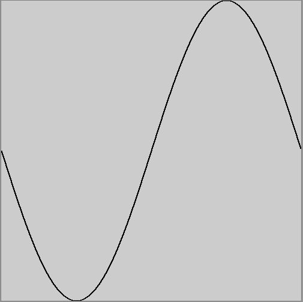

Game Engines 1 Labs
===================

Lab 8
-----
You can use the master branch for this lab. Clone/fork/pull etc as necessary to get what you need. 

### Part 1
Make a subclass of ```GameComponent``` called ```Steerable2DController```. It should implement 2D steering for any class it's attached to. You should:

- Add a field for the force accumulator
- Add fields to control the keys used to push the object
- Add a field to control damping
- Add an update method where you check the key presses and apply the following forces
	- A steer left force (force in the direction of the left vector)
	- A steer right rorce (force in the direction of the - left vector)
	- A push force (force in the direction of the look vector)
	- A pull force (force in the direction of the - look vector

Dont forget to:
- Reset the force accumulator
- Call the superclass ```Update``` method.

You can use the GravityGame class to create a GameComponent with a model attached and also attach your controller to see if it works.

### Part 2
Modify ```Steerable3DController``` to have fields that control which keys are used to apply forces to the object. Test this by creating a game component with a model and a ```Steerable3DController``` attached. Do a pull request. The first one that implements this correctly I will accept.

Lab 7
----
You can use the master branch for this lab. The aim will be to make a subclass of ```GameComponent``` that implements gravity on any component it is attached to.
- Make a subclass of ```GameComponent``` called ```GravityController```
- Add a field of type ```glm::vec3``` called ```gravity```
- In the constructor, initialise the ```gravity``` field
- Write a method ```Update``` that applies gravity to the object's ```transform```. You will have to modify the ```velocity``` and ```position``` fields.
- Write a subclass of ```Game```. 
- Instantiate some prefabs (A ```Sphere``` and a ```Box``` for example). and attach the ```GravityComponent``` to them.
- Modify ```GravityComponent``` to make the objects bounce off the ground.

Work on your assignments!

Lab 6
-----
In this lab we will be making quaternions!

Clone/pull etc the Lab6 branch with the starter code for todays lab

When you build and run the project, you will see the the Cobra Mk III  and the Ferdelance. You can control the movement of the Ferdelance using the arrow keys. You can also get the Ferdelance to go up and down using the O and L keys. To complete this lab you will need to make use of the following API calls:

```C++
glm::dot
glm::cross
glm::normalise
glm::acos
glm::degrees
glm::axisAngle // Make a quaternion. Dont forget the angle parameter is in degrees!
glm::mix // This slerps between two quaternions
```
### Part 1

Generate a quaternion for the Cobra Mk III so that it always faces the Ferdelance.

### Part 2

Modify your code so that when you press the space key, the Cobra Mk III gradually turns to face the Ferdelance. Use the ```glm::mix``` function to achieve this. ```glm::mix``` slerps between two quaternions depending on the value of the *t* parameter. If *t* is 0, the first quaternion is returned. If *t* is 1 the second quaternion is returned. If *t* = 0.5f then a quaternion half way between the first and second quaternions is returned and so on. This is what it should look like:

[](http://www.youtube.com/watch?v=lkD9tAo9T7s)

You can use the ```startQuaternion```, ```endQuaternion``` and slerping member variables to help achieve this. Just add the ```timeDelta``` to *t* for now.

### Part 3
Have the speed of rotation controlled by the ```turnRate``` field. This field is given in radians per second. To complete this you will have to:

- Calculte the angle that the Cobra Mark III needs to rotate. Use ```glm::acos``` and ```glm::dot```
- Calculate the time required to do this (angle / turnRate)
- Calculate what you need to add to t based on the time required and the time delta.

Lab 5
-----
In this lab you will be adding functionality to the Transform class and to allow jumping. This is different to the FPS behaviours we programmed on Friday in that the behaviour needs to be triggered on a key press, but happen for multiple frames. 

Consider using half a period of a sine wave function to control the height of the jump. The sine function is parameterised by theta and amplitude, where theta goes between 0 and 2 pi. A sine wave function will give numbers between -1 and +1, but you can multiply by amplitude to scale the sine wave. The figure below shows one period of a sine wave:



And here is some Processing code I used to to plot the sine wave above that you might find helpful:

~~~Java
void setup()
{
  size(500,500);
  sampleRate = width;
  amplitude = height / 2.0f;
  lasty = (float) height / 2.0f;
  lastx = 0.0f;
 
}

float frequency = 1.0f;
float sampleRate;
float theta = 0.0f;
float amplitude = 1.0f;
float pi = 3.14159285f;
float lastx, lasty;

void draw()
{
    float inc = (2.0f * pi * frequency) / sampleRate;
    lasty = (float) height / 2.0f;
    lastx = 0.0f;
    for (int x = 0 ; x < width ; x ++)
    {
      float y = (sin(theta) * amplitude) + (height / 2);
      theta += inc;
      line(lastx, lasty, x, y);
      lastx = x;
      lasty = y;      
    }
    theta = 0.0f;    
}
~~~

Alternatively, the jump height could be controlled with velocity and gravity and you will get the same result. Here are some equations you might find useful:

```
velocity += gravity * timeDelta;
position += velocity * timeDelta;
```

What to do:
- Clone/pull the master branch of BGE
- Create a member function called ```Transform::Jump(float height)```
- You will need to add additional variables to the ```Transform``` class to manage the jump.
- Jumping will need access to timeDelta. You can use ```Time::deltaTime``` to get the timeDelta now.
- Write code in the class FPSController to trigger the jump on the J key press.
- If you get this working, try and implement crouching and leaning
- If you make anything useful and nice, please do a pull request

Lab 4
-----

This lab has three parts. In the first part you will be programming the world transform matrix for the Cobra Mark 3 ship in this video so that it always points towards the Ferdelance (controllable using the arrow keys). A world transform matrix is a matrix that is generated from an object's position and orientation that is used to draw the object. In Part 2 & Part 3, you will be programming the fountain effect. Here is what the final version should look like:

[](http://www.youtube.com/watch?v=V5WQ0W0I454)

More about world transform matrices in Friday's class, or watch this video from last year (not now!)

[](http://www.youtube.com/watch?v=z8NjXaW64sQ)

### Part 1
Firstly checkout the Lab4 branch of the repo from your own clone:

```Bash
git fetch
git checkout -b Lab4 origin/Lab4
```

If you have a fork of BGE, use the following:
```Bash
git checkout -b Lab4 upstream/Lab4
```
Compile and run the program and you should get this:


Open up the file Lab4.cpp and look at the ```Update``` member function. Calling ```Game::Update()``` will call the ```Update``` member of any attached ```GameComponent```s, including ```ship1``` and ```ship2```. In the ```Update``` method, the component's world transform matrix will be calculated from it's position and quaternion (used to store orientations - we will talk about this on Friday). You can *overwrite* this by placing code *after* the base class ```Update``` call. Have a look at the end of the ```Update``` member to see that that is what is being done in this lab. The world member of ```ship1``` is just being calculated from it's position. To complete Part 1, you have to:

- Use the inv cos and vector dot product to calculate the rotation angle theta
- Check to see if you need the interior or exterior angle and adjust theta appropriately
- Create a rotation matrix
- Multiply it into the world transform of ```ship1``` *in the correct order*. 

If you are successful,  the Cobra Mark 3 ship should point at the ferdelance

Do not not ATTEMPT to solve this before:

- Drawing some diagrams
- Working out the maths/algorithm on pen and paper first.

Some API's you might need:

```C++
// These functions return a glm::mat4
glm::translate(glm::mat4(1), pos);
glm::rotate(glm::mat4(1), angleInDegrees, axis);
glm::dot(v1, v2); // Returns a float
glm::cos(thetaInRadians);
glm::acos(value);
glm::normalize(v);
// To get pi, use:
glm::pi<float>();
```
### Part 2

Look at the ```Initialise``` member function to see how to create a fountain effect. Add code to create a circle of fountain effects. The instructions are included in the comments of the for loop. See how I create the middle effect. As you are creating them (at the correct positions) add them to the std::vector fountains as well as attaching them to the Game, so we can get access to them later.  Consider how to calculate points on the unit circle as your clue to solve this. Make every second particle effect red and every other one green.

### Part 3
Modify the ```Update``` member function in the appropriate place to update the Y value position of the effects so that they rise and fall like in the video. You can use the ```glm::sin``` function for this.

Lab 3
-----
In this lab you will get the opportunity to use some vector maths to solve some problems in games. Be sure you know how to:

- Add/subtract vectors 
- Calculate the distance between two vectors using ```glm::length```
- Use the vector dot product (```glm::dot```) and inverse cos (```glm::acos```)

If you need some revision on this, be sure to read the [game maths lecture notes](../Course) again. Also here is [a great series of articles that explains vectors and matrices](http://blog.wolfire.com/2009/07/linear-algebra-for-game-developers-part-1/).
 
Firstly, navigate to where you have cloned the repo and checkout the branch for the lab:

```bash
git checkout -b Lab3 origin/Lab3
```

You might need to do a git fetch if you have cloned from my repo

```bash
git fetch
```

To get the branch, or if you are working from a fork, you might need to fetch from the upstream remote into your fork:

```bash
git fetch upstream
```

When you run the project you should see this:


Note that you can move and rotate the camera using WASD and mouse look. The ship on the right is called a Ferdelance. Note that you can move it forward by press the UP key and you can rotate it by pressing the LEFT arrow key. The ship on the left is called a Cobra Mk III.

Now open up the file Lab3.cpp and observe the ```Update``` member function

### Problem 1

Add the missing code to complete the Ferdelance movements - to move backwards and to rotate to the right. Based on the code, can you figure out which direction rotations work in OpenGL clockwise or counterclockwise?

### Problem 2

Add code to move and rotate the Cobra MK III in response to the UHJK keys.

### Problem 3

Add code to calculate the distance between ship1 and ship2. If the distance is < 5 units you should print a message saying "In Range", otherwise print the message "Not in range". You can use:

```C++
PrintMessage("Hello");
```

To print a message to the list of messages on the screen. Move ship2 around the place and make sure this works ok.

### Problem 4

Write code to check to see if ship2 is in front of or behind ship1. Print the messages "In front" or "Behind"

### Problem 5

Write code to check to see if ship2 is inside the FOV of ship1. Use a 45 degree FOV. You need to draw this problem out on paper before attempting to solve it. Use the dot product in your solution.

### Problem 6

If ship2 is inside the FOV of ship1, fire lazer beams at a rate of 2 per second. To fire a single lazerbeam, use the following code:

```C++
shared_ptr<LazerBeam> lazer = make_shared<LazerBeam>();
Attach(lazer);
```

This attaches a lazerbeam object to the scene. Dont forget to set the lazer beam look and position vectors!

If all goes well, your final scene should look like this:


Lab 2
-----

### Part 1 - git
In this part of the lab you will be leaving your "mark" on the BGE repository. 

- If you need to, [watch the video of last week's git lecture](https://www.youtube.com/watch?v=p_PGUltnB6w) and [read the notes](../Course/Game Engines 1a.md). You should also read the first three chapters of the [git manual](http://git-scm.com/documentation).
- Read [this document that explains how to fork a repository](https://help.github.com/articles/fork-a-repo) and then make a fork of the BGE repository into your own GitHub account.
- Check out the master branch of your own fork of BGE.
- Read [this article that explains how to set up syncing](https://help.github.com/articles/syncing-a-fork) of the orginial BGE with your fork of BGE. Do it!
- Create a "feature branch". Call it whatever you like (how about "graffiti").
- Edit the file contributers.txt and leave your name and message. No offensive comments or profanity
- Commit your changes back to the repo and push your branch back to your fork of BGE. 
- Read [this article that describes how to make a pull request](https://help.github.com/articles/using-pull-requests). Make a pull request.
- When you have made the pull request, let me know and I will accept your pull request. 
- Once I have accepted a few pull requests, sync the master branch of your fork with my master branch of BGE to get my changes.     

### Part 2 - C++

The aim of this lab is to modify the solution to last week's lab to create a new class called AITank that patrolls around the outside of the screen. As a bonus, you can have bullets dissappear when they come within 20 units of the centre of the AI tank. You can print a message out on the console when this happens. Here is a screenshot of what the finished lab should look like:


To get started!

Clone the solution to last weeks lab by typing: 

```bash
git clone solution  https://github.com/skooter500/sdl-sprites-lab
```

If you already have a build of the project on your computer, you can just get the solution branch by navigating to where you have the project cloned to already and typing:

```bash
git checkout -b solution origin/solution
```

To get the constants for pi etc:

Put 

```C++
#include <glm/gtx/constants.hpp>
```

At the top of any file that needs them

Use: 
```C++ 
glm::pi<float>()
``` 
and 
```C++ 
glm::half_pi<float>() 
``` 
Etc.

You can just crack on and see if you can complete the lab, though here are step-by step instructions if you need them:

- Start by creating a new class called ```AITank``` and make it extend ```GameComponent ```. Check out the player class for a template for this.
- Give it the same member functions and variables as the ```Player``` class
- In the constructor, set the initial position, rotation and look vector values. Use the unit circle to see what these should be.
- Copy the ```Initialise``` and ```Draw``` member functions from ```Player```
- In ```Update```, just move the tank in the direction of it's look vector and recalculate the look vector based on the rotation member variable. (For now)
- In the ```Game``` class, make a shared_ptr member variable public member of the class
- In the ```Initialise``` method of the ```Game``` class, create the instance and add it to the list of children
- Now in the ```Update``` member function of the ```AITank```, put in code to rotate the tank when it reaches close to the bounds of the screen
- Once you have that all working, in the ```Bullet``` Update method, get the ```AITank``` shared_ptr from ```Game::Instance()``` (remember you made it a member variable earlier?)
- Calculate the distance to the ```AITank``` and if < 20, set the bullat alive flag to be false etc.
Have fun!!

Think about your assignment

Lab 1
-----
### Part 1
In this weeks lab you will be installing some of the prerequisites required to run the BGE code in the lab. 

Firstly you will have to clone the source code for this weeks lab from the git hub repo...

Start a git bash shell, create a new folder on your U drive or a USB stick and navigate to it.

Type the following EXACTLY:


git clone https://github.com/skooter500/sdl-sprites-lab

This will fetch the required files, including the visual studio project file from the github repository. If you navigate to the folder and open up the Visual Studio Solution and hit F5, you will see that the project will not compile. This is because you are missing two required open source libraries to run the project. These are:

GLM - Maths Library

SDL - Simple Direct Media Library. This is a really cool open source game development library that provides cross platform access to hardware such as screen buffers, the keyboard & mouse, audio etc. Its used in lots of commercial games such as Valve's Team Fortress 2

Firstly go to [http://glm.g-truc.net/0.9.5/index.html](http://glm.g-truc.net/0.9.5/index.html) and download and install the GLM libraries. This is a header file only library. To set this up in your project, navigate to:

Project | Properties | VC++ Directories | Include Directories - And enter the path to the include directory for the GLM libraries you just downloaded

Make sure you select the project in the project explorer first!

Now go to  [http://www.libsdl.org/download-2.0.php](http://www.libsdl.org/download-2.0.php) and download the appropriate Development Libraries for your platform (Windows or Mac)

Go to: 

Project | Properties | VC++ Directories | Include Directories - And enter the path to the include folder in SDL

Go to:

Project | Properties | VC++ Directories | Libary Directories -  And enter the path to the lib\x86 folder in SDL

There are similar settings for Xcode/Eclipse for those on the mac.

You might find it easier to navigate to the folder in Explorer and copy the paths out of the address bar.

Now go to:

Project | Properties |  Linker | Input | Additional Dependancies

And ADD SDL2main.lib;SDL2.lib;

If you have followed the above steps EXACTLY your program should now build

BUT Guess What! It wont run. Visual Studio will complain about a missing SDL DLL. 

There are several ways to solve this problem, but the easiest is to add the path to the sdl dll files to the Project | Properties | Debugging | Environment setting:


If all the above works you should get a screen like this:


Congratulations! 

If you didnt get a screen like this, go back and make sure you have followed the steps correctly. 

Now spend some time to understand the code. The main classes are:

GameComponent - Everything in the game will extend this.

Game - Extends GameComponent and keeps an stl::list of GameComponent's (like a List in C# or an ArrayList in Java)

Player - Extends GameComponent and manages the player sprite

You should realise that the code is not much different to what we wrte in the class last week, just with rendering added.

Some things to try:

Try and figure out how to get the player tank to rotate in response to the left and right arrow keys. You might remember how to do this from second year Allegro :-) You can use the following:

```C++
glm::sin(theta);
glm::cos(theta);
```

To calculate the look vector based on the value of rotation. These functions accept parameters in RADIANS. Keep in mind that the rotation parameter to the function:
```C++
SDL_RenderCopyEx
```
Needs to be in DEGREES

You can use the function:
```C++
glm::degrees
```
To convert from radians to degrees

Try and create a Bullet class (another subclass of GameComponent) and get the player to fire bullets when the space key is pressed

Try and figure out how to adjust the fire rate so that the tank can only fire 10 bullets per second (hint - use the time delta)

Try and get the bullets to be removed from the scene when they go outside the bounds of the screen.

###Part 2
Try and get BGE to compile. You can clone it by typing:

git clone https://github.com/skooter500/BGE

You need to download the Dependencies from here: [http://1drv.ms/1olPefQ](http://1drv.ms/1olPefQ) And unzip to the Dependancies folder in your Solution. Your folder structure should look like this:


I am curious to see if this works without installing the Kinect/Leap SDK's and drivers.
