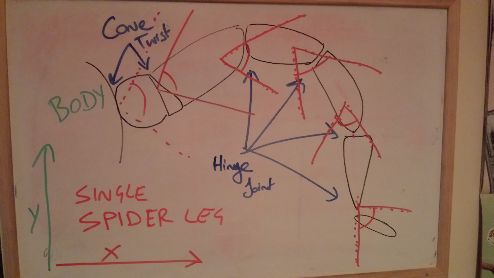
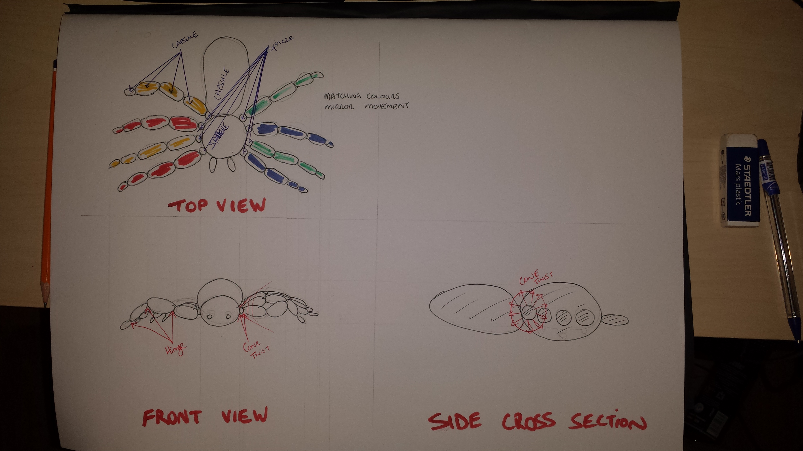

Name: 	Anthony Hayden
No:		C11733511

Description:
-This assignment will produce an articulated recreation of a spider.
-It will uses capsule and sphere rigid bodies to make up the model
along with hinge & cone twist joint types, primarily in the legs.
-The spider will move on it's own once spawned with it's direction
changing randomly.

